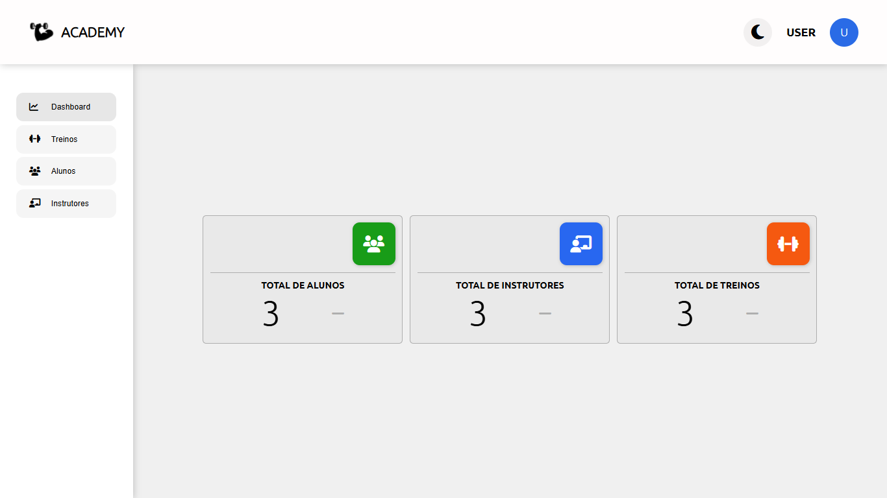
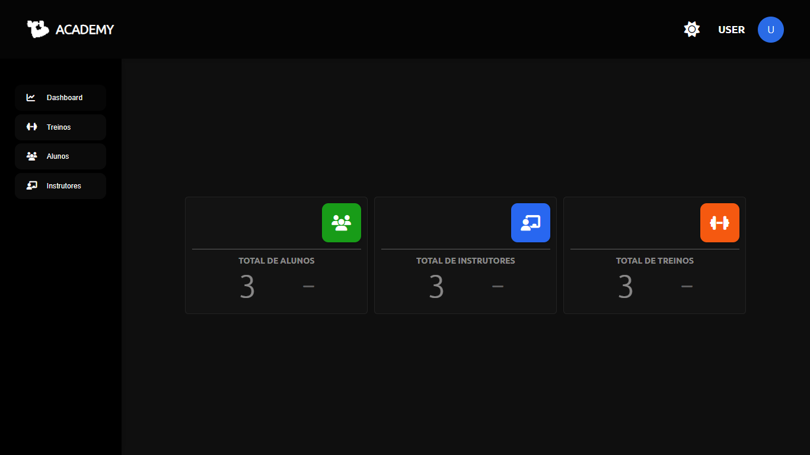
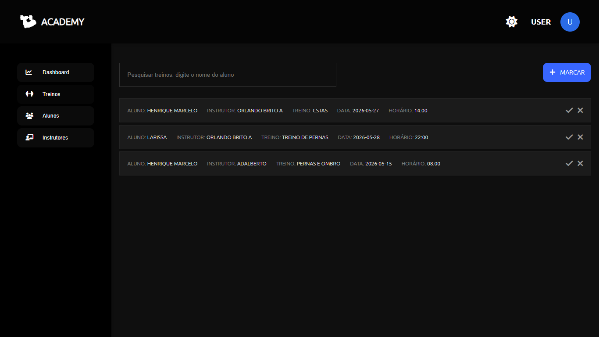
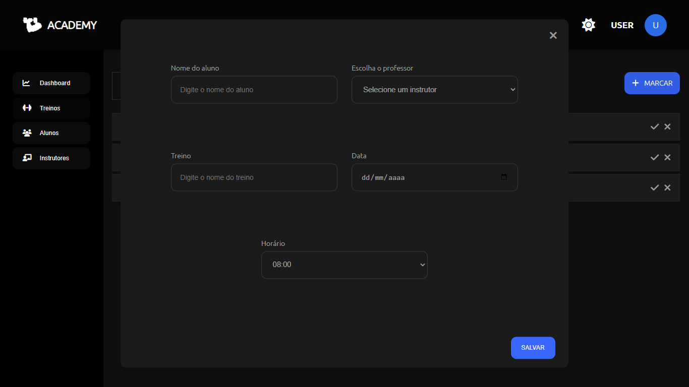
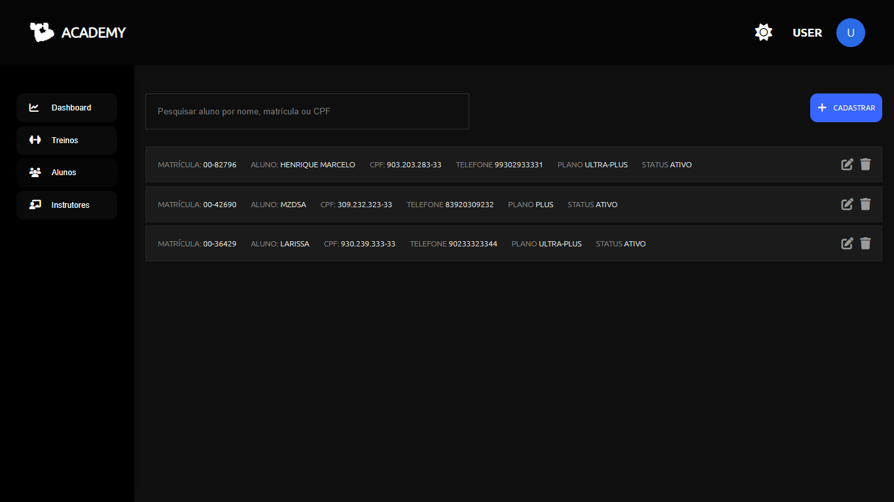
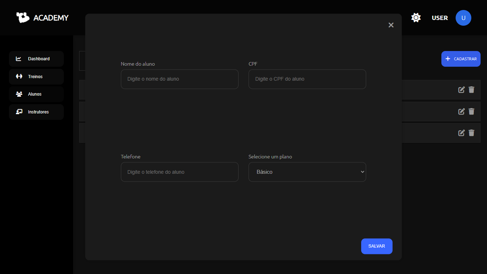
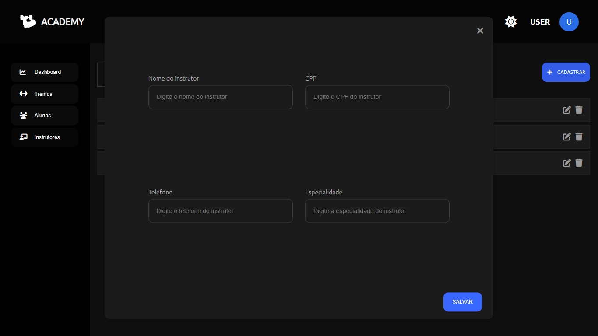

## ACADEMY 📌
[👮] **Autor**: Pedro Henrique.  
[📅] **Data**: 17/05/2026.  
[📌] **Tipo**: Academia.  
[💻] **Deploy**: [Academy](https://eupedrobarbosa03.github.io/academy/).

---

Academy é um gerenciador de academia que possibilita cadastro de alunos e instrutores, marcação de treinos, edição de alunos e instrutores, remoção de alunos, instrutores e treinos, marcação de treino como concluído. Informações atualizadas em tempo real com renderização por storage. Um dashboard simples em tempo real que permite a visualização de quantidade de alunos, instrutores e treinos. 

---
### TECNOLOGIAS E CONCEITOS UTILIZADOS 💻
**[⚙️] Tecnologias**: HTML5, CSS3 e typescript.  
**[📗] Conceitos**: interface-ts, generics, localstorage, poo, dom, regExp, modules, closure, typeAlias, render, responsividade.  
**[📁] Padrão**: Desenvolvido em módulos e classes.

---
### FUNCIONALIDADES DO SISTEMA ✅
**[✅] RegExp** global para informações como: nome, cpf, telefone, especialidade e nome do treino.  
**[✅] Tema** dark e light para a preferência do usuário.  
**[✅] Dashboard** em tempo real por render, storage e DOM.    
**[✅] Caixa de informação** para ações em: treinos, alunos e instrutores. Exemplo: passar o mouse em cima do ícone de editar.  
**[✅] Sistema de pesquisa** por cada letra digitada para encontrar o item procurado rapidamente.  
**[✅] Marcação de treinos** com validações **regExp** e a não permissão de marcar treinos em horários já ocupados na data escolhida.   
**[✅] Renderização por storage** para edição, adição de itens para evitar **bug's** desnecessários.  
**[✅] Local storage** para salvar todas as informações necessários para o funcionamento correto do sistema.  
**[✅] Mensagens de erros e borda vermelha nos input's** para uma experiência de usuário agradável.  

---

## 📸 Demonstração do Sistema

### 📊 Dashboard

  
   
  
   

---

### 📊 Treinos

  
   
  
   

---

### 📊 Alunos

  
   
  
   

---

### 📊 Instrutores

  
   
  
   

---

Explorem, divirtam-se. Fiquem à vontade para melhoria do projeto — eu ficaria feliz com isso, mais feliz ainda se me notificar. 

